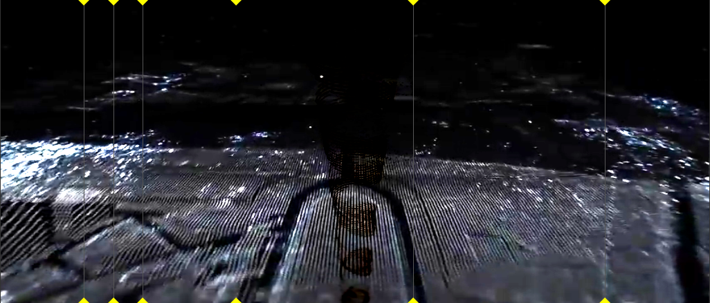

## How-to

Fragment excel at graphics because it use a specifically designed computer graphics languages as it's basis.

Complex graphics can be generated within Fragment, videos, images and many other type of inputs can also used and the graphics can be controlled with peripherals.

Graphics can be synchronized to the synthesized sound easily.

Many computer art example compatible with Fragment are available on [ShaderToy](https://www.shadertoy.com), just copy any single file code and paste it into the Fragment code editor then click on the "Convert from ShaderToy" button.

You can also use Processing sketchs (require a Processing.js input), a good source of Processing art can be found here : [OpenProcessing](https://www.openprocessing.org/)

