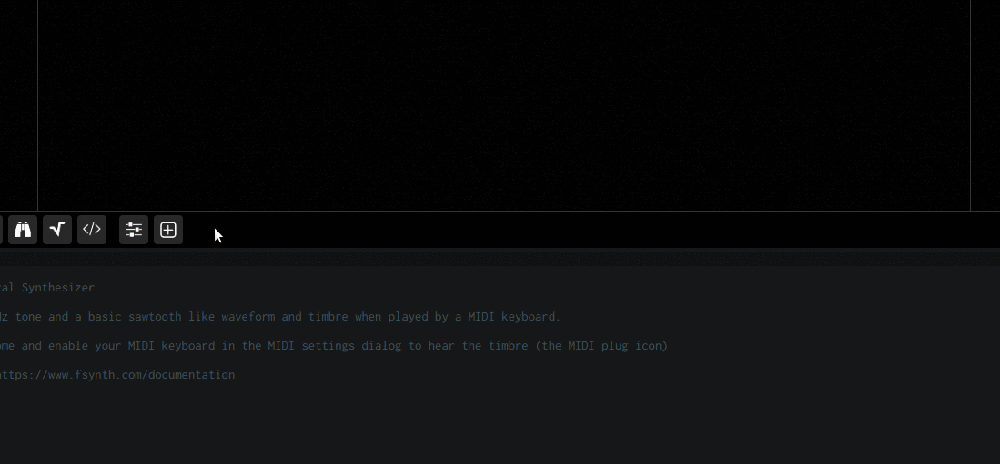
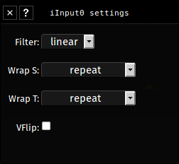

## About

Images can be imported by using the associated import dialog button or by drag and dropping image files onto the dropzone area of the import dialog.

Any common images format can be imported that way.

Once an image is added, several actions are available by clicking on the image thumbnail

- image settings
- export as PNG (open a new window)
- delete

## How-to



### Using images

Images data can be accessed from the fragment shader by using the *texture* function which has the following definition

```glsl
vec4 texture(iInputN, vec2 texCoord);
```

There is several other functions (see GLSL section) that can be used with textures such as *textureOffset*

#### Image access

Simplest example which map the entire image on the totality of the canvas

```glsl
void main () {
  float l = 0.;
  float r = 0.;

  vec2 uv = gl_FragCoord.xy / resolution;

  vec4 tex_data = texture(iInput0, uv);

  fragColor = vec4(l, r, 0., 1.) + tex_data;
  synthOutput = vec4(l, r, 0., 0.); // WebGL 2 only
}
```
#### Image settings

Imported images have several settings which can be quickly accessed by right-clicking on the image thumbnail or by left-clicking on the image thumbnail and by clicking on the *settings* button, the image settings dialog will be shown



##### Filter

> Since texture coordinates are resolution independent, they won't always match a pixel exactly. This happens when a texture image is stretched beyond its original size or when it's sized down. OpenGL offers various methods to decide on the sampled color when this happens. This process is called filtering. 
>
> [OpenGL textures](https://open.gl/textures)

linear


- Give a smooth result with a weighted average of the surrounding 4 pixels
- Recommended when using [spectrogram](https://en.wikipedia.org/wiki/Spectrogram) images, the resulting audio may be more pleasant

nearest


- This is the image processed as-is, this can give a pixelated look and may sound raw with abrupt changes between amplitudes

mipmap


- Bilinear filtering + mipmap, mipmap are pre-calculated lower resolution representation of the image, this feature can be useful to produce cheap blur and other effects or reduce aliasing artifacts with visuals. (Note : `textureLod` must be used to access specific mipmap level in the code)

##### Wrap S/T

When the texture is sampled and the given coordinates are outside the range of `0` to `1`. Fragment offer 3 ways of handling the resulting image

clamp (default)


- The image will be as-is without anything (black) outside the range of `0` to `1`

repeat


- The image will repeat

mirrored repeat


- The image will repeat in a mirrored fashion

##### VFlip

This can be checked to flip the image along the vertical axis, if your image is upside-down, this can be used to fix it

