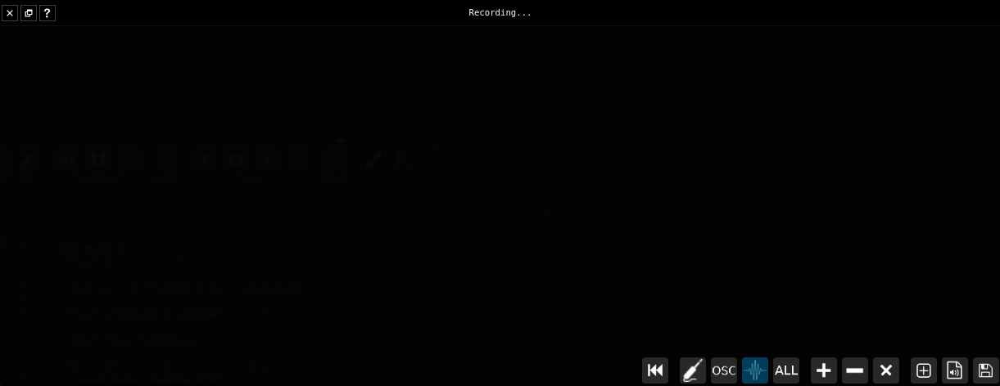

## About

The spectral record dialog is a dialog which record the slices / instruments content.

The recording can be exported to a .PNG image, saved to disk as a .WAV file or imported back into Fragment as an input.

The export to .WAV can be very useful since the exported file will be named with 100% accurate fundamental frequency informations along with the note name, session and current date, this can be a used as a tool to constitute a samples library or as a source for Fragment granular synthesis.

Note : .WAV export **only use additive synthesis**

By default the recording replace the old content with actual slices content.

The recording area width correspond to the width of the session score or the user defined `record width` value in settings.

There is two record mode which can be toggled from the toolbar button :
* continuous recording which will continuously record the canvas content and loop back at the end
* one-shot recording which will stop at the end, rewind can be triggered by any MIDI event or by the toolbar buttons

Here are the toolbar details from left to right :

* rewind all : this rewind the recording plus reset globalTime to 0 (similar to rewind + transport rewind)
* rewind : this rewind the recording only
* record mode : when on the recording will stop automatically otherwise the recording is continuous
* record MIDI only : toggle to only record MIDI output
* record OSC only : toggle to only record OSC output
* record synth data only : toggle to only record synth data output (default)
* record all : toggle to record all types (they are added together)
* add compositing mode : when on the content will be added with incoming slices data (preserving the old data)
* substract compositing mode : when on the content will be substracted with incoming slices data
* multiply compositing mode : when on the content will be multiplied with incoming slices data
* add actual content into the session input list
* download the content as a .WAV file (additive synthesis conversion)
* download the content as a .PNG file

Importing the record to Fragment allow to play it back and manipulate it (pitch shifting etc.), it is the same concept as audio samples except that it work with images data instead of audio data.