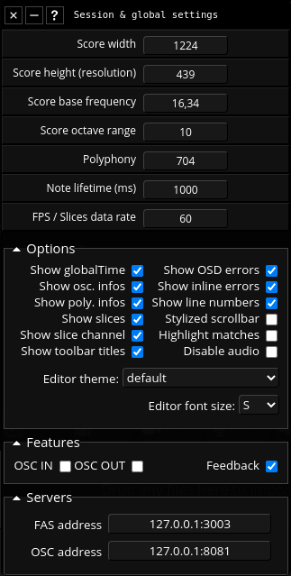

## About

Fragment support a variety of global and session related settings through the settings dialog.

Detailed description of the settings

Score width

- The score width in pixels units

Score height

- The score height in pixels units
- Higher height = better frequencies resolution

Score base frequency

- Determine the base frequency in hertz units

Score octave range

- Control the range of frequencies

Osc. fadeout

- WebAudio fadeout time (like a global "release" parameter in other synths, WebAudio oscillators only)

Polyphony

- Maximum polyphony

Note lifetime

- The lifetime of a note in **ms**, this is usefull to handle MIDI keys note-off & release sections part of envelopes

Show globalTime

- Hide/Show the globalTime in the informations bar

Show osc. infos

- Hide/Show the number of oscillators playing simultaneously in the informations bar

Show poly. infos

- Hide/Show the polyphony infos for per output channels in the informations bar

Show slices bar

- Hide/Show slices vertical bar

Show line numbers

- Hide/Show the line number in the code editor

Advanced scrollbar

- Enable/disable a better looking scrollbar for the code editor

Highlight matches

- Enable/disable matches highlight in the code editor (when something is selected)

Show slices

- Hide/Show slices, can be useful for visuals, this settings is not saved
  Monophonic

Enable/disable monophonic mode

- If monophonic is enabled, only the alpha value is used by 
  the synthesis engine, the full RGB output can then be used for visuals

AudioWorklet

- Enable/disable WebAudio AudioWorklet, a fast in-browser additive synthesis engine (enabled by default if supported, this may require a recent browsers)

OSC IN

- Enable/disable OSC input, you can add and controls uniform variables through OSC, you will need an [OSC relay](https://github.com/grz0zrg/fsynth/tree/master/osc_relay) to use this feature

OSC OUT

- Enable/disable OSC output, slices data will be sent through OSC bundles via WebSockets, you will need an [OSC relay](https://github.com/grz0zrg/fsynth/tree/master/osc_relay) to use this feature

Feedback

- Enable/disable the availability of the previous frame in the Fragment shader (aka feedback), this is useful for complex effects, may be CPU/GPU intensive

Editor theme

- A list of code editor themes

OSC address

- The location of the OSC relay on the network

FAS address

- The location of [FAS (Fragment Audio Server)(https://www.fsynth.com/documentation.html#fas) on the network