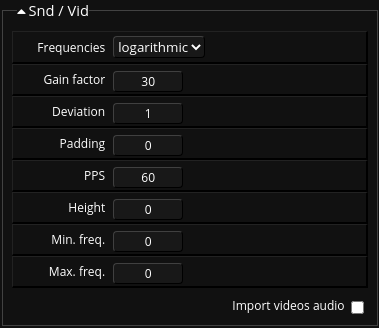

## About

Sounds can be imported by using the associated import dialog button or by drag and dropping sound files onto the dropzone area of the import dialog.

Any common monophonic or stereophonic audio format can be imported that way.

Fragment does not import the audio data as-is but convert it to a stereophonic spectogram image, this is the spectral capability of Fragment.

Imported sounds can be used for re-synthesis, vocoder effects etc., transformations and various processing can be applied in real-time to the resulting spectogram which will be played back by any of the synthesis methods that Fragment support, it is for example possible to do re-synthesis based on granular synthesis or granular synthesis and additive synthesis at the same time.

Once a sound file is added, a conversion phase which perform audio analysis and conversion to bitmap data will execute, this conversion phase may take several minutes depending on the sound duration and audio settings, please wait if your sound file isn't added yet. (note : a progression notification will be outputted in one of the screen top corner)

Once the sound is converted to an image, several actions are available by clicking on the resulting image thumbnail, see *images import* section for the actions details.

Many sounds can be imported at the same time, Fragment will convert them to images one by one.

## Import settings

The audio import settings which can be found in the import dialog are the settings associated to the audio analysis process (gabor wavelet analysis) which perform the conversion of audio data to pixels data (spectogram), tweaking the various settings can give a wide range of different spectogram with varying re-synthesis quality

* Frequencies : scale type (how are frequencies mapped to the image) with two type; logarithmic or linear
* Gain factor : the amount of gain, increase it when the converted sound is very dimmed
* Deviation : values near zero have better frequency resolution, values towards infinity have better time resolution
* Padding : the amount of padding to add (this avoid start / end artifacts if any)
* PPS : Pixels Per Seconds; this adjust the image width; low pps will result in longer images while high pps will result in a more condensed image
* Height : can be used to alter the resulting image height; A value of 0 will automatically generate an image height equal to the score height
* Min. freq. : alter the frequency mapping of the resulting image. A value of 0 will automatically assign the score defined minimum frequency
* Max. freq. : alter the frequency mapping of the resulting image. A value of 0 will automatically assign the score defined maximum frequency

##### Import videos audio

This settings is used for all videos import, if checked, Fragment will import the audio channel independently of the visual channel, this mean that there will be two images generated from a single movie file

## How-to

Since sounds are converted to images, see *images import* section for the usage of images