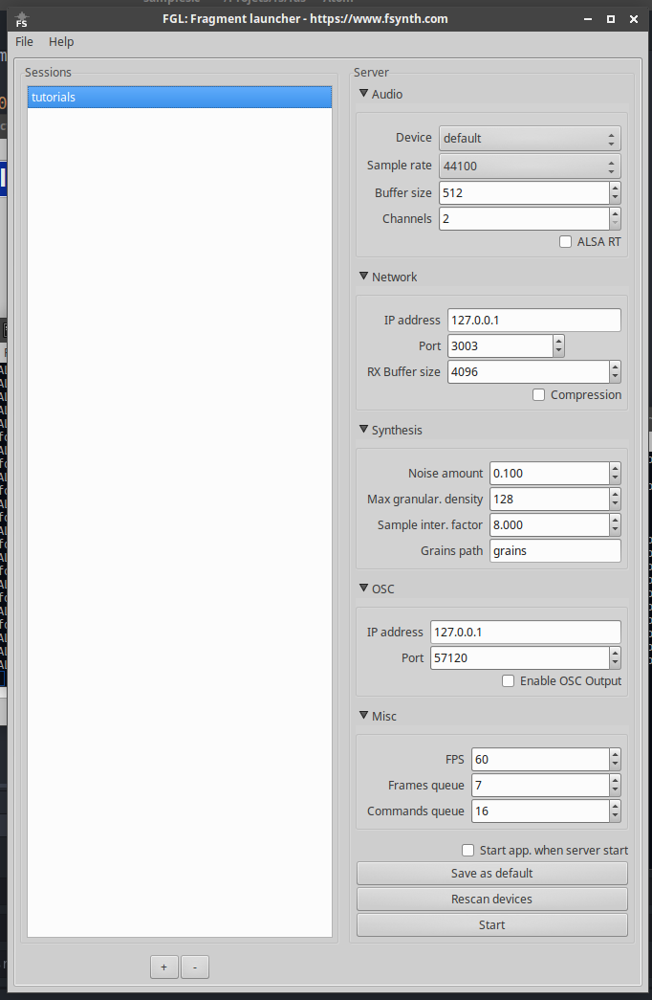

## About

The Fragment Audio Server is a program written with the C language which is able to do very fast real-time audio synthesis.

It is recommended to use Fragment with the Fragment Audio Server enabled

The advantage of using the audio server is that it provide the **best audio performances** along with **audio devices choice**, **multiple audio outputs**, sample rate choice, **granular synthesis** / sampler, subtractive and PM synthesis method, **distributed sound synthesis** over multiple machines or cores, realtime scheduling under Linux and more...

The Fragment web-client communicate with FAS by sending data through the network when the FAS option (the waveform icon in the main toolbar) is enabled, FAS can run on any machines independently of the Fragment application, it gather the pixels data from Fragment in real-time, compute things and deliver the audio through the selected audio device.

On the [Raspberry PI](https://www.raspberrypi.org) ~700 additive synthesis oscillators can play at the same time with an optimized system

## How-to

FAS audio server is packaged with the graphical launcher which can be downloaded on the Fragment [homepage](https://www.fsynth.com/).

The graphical launcher provide a graphical user interface to configure the audio server settings **per sessions**, it also allow to start the audio server & the web client easily.

### Quick launch

1. Add a session by clicking on the [+] button (the launcher save settings per sessions)
2. Select the created session by clicking on it
3. Check "Start app. when server start"
4. Click on the "Start" button to launch the session, the audio server should start and the web client should start as well

### Manual launch

The audio server can be compiled from the sources which are available on [GitHub](https://github.com/grz0zrg/fas).

The audio server can be launched manually by executing it, it will listen to 127.0.0.1:3003 by default and will use the default audio device, see the [GitHub](https://github.com/grz0zrg/fas) README file for all the command-line arguments that the program support.

Once the audio server is started, a link between the audio server and the Fragment application has to be done, the connection can be enabled/disabled by clicking on the waveform icon on the main toolbar.