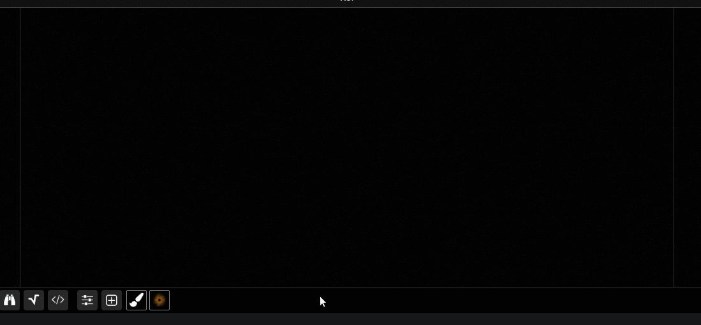

## About

Canvas inputs can be created by using the associated import dialog button.

This is a specific feature which allow to interact directly with the created input texture by drawing over it with the mouse cursor in real-time like a paint program, it use image brushes which work with all imported images.

Fragment is bundled with 20 high-quality brushes and 949 are available as a separate download, brushes and the import dialog is intertwined, if you import images with the import dialog, they will be available as brushes.

Any number of canvas can be created within Fragment.

A complex usage example of this feature is to record a sequence by using the *recording dialog*, export it as a Fragment input, the sequence will then be available as a brush, several sequences can then be integrated into one and the result processed by the fragment shader.

## How-to

You can draw on any canvas by right-clicking on the canvas input thumbnail, Fragment will select it, display the canvas content above the main canvas and enter in paint mode, the canvas settings dialog will then be displayed.

To draw on the canvas input, you must first select a brush in the "paint tools" dialog, you can then paint directly over the main canvas by left-clicking anywhere on it, you can erase (substract) by right-clicking on the canvas.

You can directly draw on the graphical score when a canvas input is selected but you cannot move or add slices anymore, you must unselect the selected canvas input before.

A right click on a selected canvas input thumbnail will unselect it.

##### Usage

The canvas can be accessed like images. See *note* section for specific usage related to the bundled brushes.

## Paint tools

Canvas paint tools  can be accessed by right-clicking on the canvas input thumbnail, this will also select it.

The paint tools dialog has three parts

- a toolbar
- brush settings
- brushes list

The toolbar actions are

- Clear the canvas content
- Lock the horizontal axis when drawing
- Lock the vertical axis when drawing
- Randomize
  - Randomize brush scale, opacity and angle parameter when painting
- Compositing methods selection
  - Compositing methods details can be found [here](https://developer.mozilla.org/fr/docs/Web/API/CanvasRenderingContext2D/globalCompositeOperation)

The brush settings

- Brush width scale
- Brush height scale
- Brush opacity
- Brush angle
- Brush spacing delay (milliseconds)

Any actions affecting brushes will display an overlay helper for some seconds to help you visualize the changes.

Any brushes can be selected by clicking on their thumbnail displayed in the brushes list 

## Note

The bundled brushes data is specifically encoded for monophonic usage, all the pixels data is encoded inside the alpha channel, using the alpha channel as R/G/B output in the fragment shader to display a drawing made of those brushes is thus mandatory.