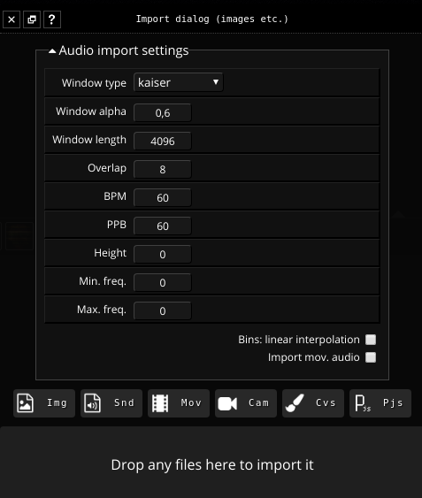

## About

Fragment allow data import through the import dialog.

Fragment allow the import of

- images
- sounds
- videos (images and sounds)
- camera (only images)
- canvas

The imported data are all transformed into a 2D texture automatically bound to a GLSL uniform, all GLSL inputs can be used as a 2D texture (**texture** keyword) within the fragment program, they are pre-defined as **iInputN** where N is the id (position) of the input starting from 0.

Sounds import has specific analysis settings which can be used to fine-tune the data conversion.

Mass import is supported by drag and dropping files onto a specific part of the import dialog.

