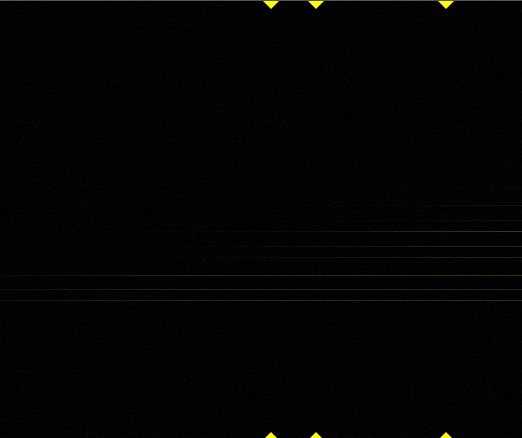

## About

Fragment has the capability to provide a visual feedback over any parameters by modulating the parameters with the current horizontal or vertical position, the canvas will then show you the changes along the chosen axis.

Specific parts can be listened by adding and positioning slices on the canvas, you can also modulate the horizontal position to move between parameters possibilities.

By adding many slices at different positions, complex sounds can be built and explored easily without code.

Here is an example demonstrating harmonics change along the X axis related to the LPF cutoff parameter



## How-to

```glsl
float adsr(float t, vec4 v, float s) {
  v.xyw = max(vec3(2.2e-05), v.xyw);
  float ta = t/v.x;
  float td = max(s, 1.0-(t-v.x)*(1.0-s)/v.y);
  float tr = (1.0 - max(0.0,t-(v.x+v.y+v.z))/v.w);
  return max(0.0, min(ta, tr*td));
}

float lpf(float x, float c, float s) {
  return .5 + .5 *(atan(s*cos(3.141592653 * min(max((x-c) * s,0.),1.)))/atan(s));
}

void main () {
  vec2 uv = gl_FragCoord.xy / resolution.xy;

  float l = 0.;
  float r = 0.;

  const float harmonics = 16.;

  for (int k = 0; k < 8; k += 1) {
    vec4 data = keyboard[k];

    float kfrq = data.x;
    float kvel = data.y;
    float ktim = data.z;
    float kchn = data.w;

    if (kfrq == 0.) {
     	break; 
    }

    float cutoff = htoy(kfrq) / resolution.y;
    float slope = 3. + sin(ktim * 16.) / 4.;

    for (float i = 1.; i < harmonics; i += 1.) {
      // we multiply the cutoff parameter by the horizontal position
      float f = lpf(uv.y, cutoff * uv.x, slope);

      float attack = 0.05;
      float decay = 0.6;
      float sustain = 0.;
      float release = 0.25;
      float dec_amp = 0.;
      float env = kvel * adsr(ktim, vec4(attack, decay, sustain, release), dec_amp);

      l += fline(kfrq * i) * f * env;
      r += fline(kfrq * i) * f * env;
    }
  }

  gl_FragColor = vec4(l, r, 0., 1.);
  synthOutput = vec4(l, r, (l + r) / 2., 0.); // WebGL 2.0 only
}
```