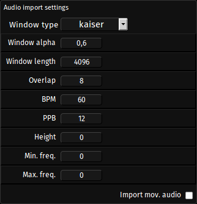

## About

Sounds can be imported by using the associated import dialog button or by drag and dropping sound files onto the dropzone area of the import dialog.

Any common monophonic or stereophonic audio format can be imported that way.

Fragment does not import the audio data as-is but convert it to a stereophonic spectogram image, this is the spectral capability of Fragment.

Imported sounds can be used for re-synthesis, vocoder effects etc., transformations and various processing can be applied in real-time to the resulting spectogram which will be played back by any of the synthesis methods that Fragment support, it is for example possible to do re-synthesis based on granular synthesis or granular synthesis and additive synthesis at the same time.

Once a sound file is added, a conversion phase which perform audio analysis and conversion to bitmap data will execute, this conversion phase may take several minutes depending on the sound duration and audio settings

Once the sound is converted to an image, several actions are available by clicking on the resulting image thumbnail, see *images import* section for the actions details.

Many sounds can be imported at the same time, Fragment will convert them to images one by one.

## Import settings

The audio import settings which can be found in the import dialog are the settings associated to the audio analysis process (overlap-add STFT processing) which perform the conversion of audio data to pixels data (spectogram), tweaking the various settings can give a wide range of different spectogram with varying re-synthesis quality

##### Window type

Several window type can be chosen for the analysis process, some types are better than other to extract specific features of the sound, some window accept a parameter (window alpha) which you can change to obtain different window

The **kaiser** window type is the default window, it provide generally good result

- hann
- triangular
- hamming
- bartlett
- bartlettHann
- blackman
- cosine
- gauss
- lanczos
- kaiser
- nutall
- flattop
- rectangular

##### Window alpha

This is a parameter that some window accept and which allow to obtain different window from the same window type

The window that support a parameter are

- blackman

- kaiser: a window alpha parameter of 3 will generally provide good results

- gauss

##### Window length

This parameter set the window length, generally a power of two, the default value is 4096.

The **window length** influences the temporal or frequency resolution of the analysis, longer windows give less temporal resolution and better frequency resolution while short window give high temporal resolution and less frequency resolution.

##### Overlap

Overlap is an important parameter for the quality of the analysis, high overlap will slow down the overall conversion time but the resulting spectogram will be kind of smoother and of better quality

##### BPM - Beats Per Minute

This settings associated with the PPB settings are used for the resulting image width, low bpm will result in longer images while high bpm will result in a more condensed image

##### PPB - Pixels Per Beats

This settings associated with the BPM settings are used for the resulting image width, low ppb will result in longer images while high ppb will result in a more condensed image

##### BPM/PPB Computation

The relationship between BPM and PPB is given by `(1.0 / ppb) * (60.0 / bpm)`

The default BPM and PPB values (60) are optimized for a refresh rate of 60 FPS by default

##### Height

This settings can be used to alter the resulting image height

A value of 0 will automatically generate an image height equal to the score height

##### Minimum frequency

This settings can be used to alter the frequency mapping of the resulting image.

A value of 0 will automatically assign the score defined minimum frequency

##### Maximum frequency

This settings can be used to alter the frequency mapping of the resulting image.

A value of 0 will automatically assign the score defined maximum frequency

##### Linear interpolation

Enable linear interpolation between FFT bins.

##### Import movie audio

This settings is used for the videos import, if checked, Fragment will import the audio channel independently of the visual channel, this mean that there will be two images generate from a single movie file

## How-to

Since sounds are converted to images, see *images import* section for the usage of images