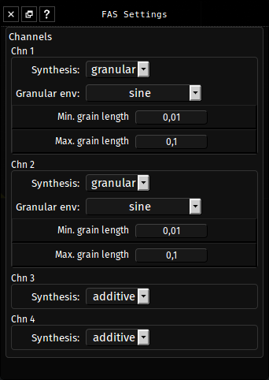

## About

Fragment has support for simultaneous additive and granular sound synthesis, subtractive synthesis is also available.

Granular synthesis only work with the Fragment Audio Server.

The two main synthesis method that Fragment support can be combined in real-time to enhance the synthesized sound.

When using the Fragment Audio Server, you can configure the synthesis methods per channels with the FAS settings dialog accessible by right-clicking on the waveform icon of the main toolbar

Channels settings appear automatically when they are assigned to slices. 

You can rescan the grain folder on the audio server by clicking on the corresponding button.

Synthesis

- The synthesis method to use for this particular channel

Granular envelope

- The granular envelope to use

Minimum grain length

- The minimum grain length in samples percent

Maximum grain length

- The maximum grain length in samples percent

## How-to

### Additive synthesis

Additive synthesis is a mean to generate sounds by adding sine waves together, it is an extremely powerful type of sound synthesis able to reproduce any waveforms in theory.

This is the default and main sound synthesis method.

### Granular synthesis

Granular synthesis is the secondary synthesis method available with the Fragment Audio Server.

The Fragment Audio Server load all samples from a **grains folder** and try to guess their pitch to map it on the canvas so that it match the canvas freq. mapping, under Linux and if you installed Fragment from the .deb package, the grains folder is at **/usr/local/share/fragment/grains** by default, otherwise the grain folder should be located in the audio server directory or should be specified from arguments or launcher settings.

The pitch algorithm used to find the sample pitch may be sometimes wrong on some samples, it is possible to force the pitch of a specific sample by adding the MIDI note to their filename, such as `flute_A#4.wav`  or `flute_As4.wav` for example (the note name can be lowercase or uppercase), it is also possible to force a specific frequency by adding it to the filename between `####`such as `flute_##440##.wav`

Just like with additive synthesis, re-synthesis by granular means is possible altough computationally heavy.

Fragment work with granular synthesis on pre-loaded samples, all samples (.wav, .aiff and related samples) must be placed into the **grains** folder of the Fragment launcher/server (see above)

A good source of free samples is the [OLPC](http://one.laptop.org/) sound samples available [here](http://wiki.laptop.org/go/Sound_samples)

There is also [freesound.org](http://freesound.org/)

Granular synthesis has more parameters than additive synthesis, all the parameters are encoded in slices RGBA pixels value.

The parameter are

- RED : Left amplitude
- GREEN : Right amplitude
- BLUE : Grain sample index between 0,1, also affect grain density if >= 2
- ALPHA : Grain index between 0,1, also affect playback direction if negative and grain index randomization if >= 2

Granular synthesis is recommended to be used with additive synthesis as it is able to improve the sound quality.

**Note** : Monophonic mode granular synthesis is not implemented.

### Subtractive synthesis

Subtractive synthesis start from harmonically rich waveforms which are then filtered.

This is WIP, it is somewhat slow and there is only one low-pass filter (Moog type) implemented.

There is three type of band-limited (no aliasing!) waveforms : sawtooth, square, triangle

The filter drive is a channel settings.

The parameter are

- RED : Left amplitude
- GREEN : Right amplitude
- BLUE : Moog filter cutoff multiplier; the cutoff is set to the fundamental frequency, 1.0 = cutoof at fundamental frequency
- ALPHA : Moog filter resonance [0, 1] & waveform selection on integral part (0.x, 1.x, 2.x etc)

Subtractive synthesis can be used with additive synthesis and granular synthesis to improve the sound richness.

**Note** : The waveforms are constitued of a maximum of 64 partials

### Sampler synthesis

Granular synthesis with grain start index of 0 and min/max duration of 1/1 can be used to trigger samples as-is like a regular sampler, all samples are loaded from the `grains` folder.

**Note** : Monophonic mode sampler is not implemented.